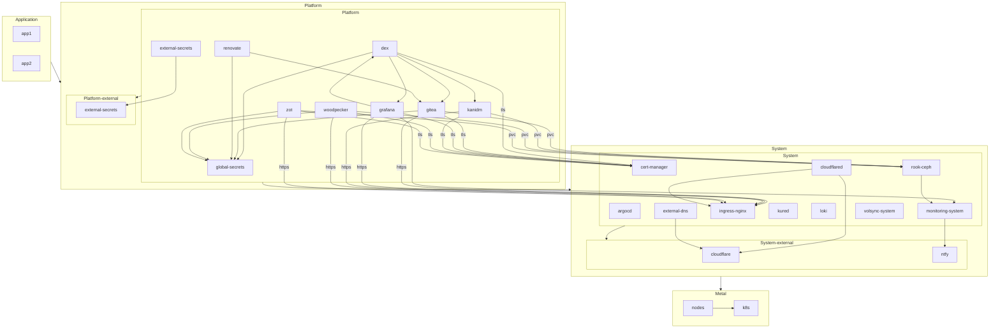

# Layers

The cluster is built in layers.

* Metal
* System
* Platform
* Application

This document desribes the components and dependencies between them.

```mermaid
flowchart TD
  subgraph apps [Application]
      app1
      app2
  end
    apps-->pf_
    subgraph pf_ [Platform]
    direction LR
      subgraph pf [Platform]
          dex
          external-secrets
          gitea
          global-secrets
          grafana
          kanidm
          renovate
          woodpecker
          zot
      end
      subgraph pfext [Platform-external]
          ex-external-secrets[external-secrets]
      end
  end
  pf-->sys_
  subgraph sys_ [System]
    direction LR
      subgraph sys [System]
          argocd
          cert-manager
          cloudflared
          external-dns
          ingress-nginx
          kured
          loki
          monitoring-system
          rook-ceph
          volsync-system
      end
      subgraph sysext [System-external]
         cloudflare
         ntfy
      end
  end
  subgraph mt [Metal]
    nodes --> k8s
  end
  
  pf-->pfext
  sys_-->mt
  sys-->sysext

  %% platform
  dex-->kanidm
  dex-- tls -->cert-manager
  dex-->grafana
  dex-->gitea
  dex-->global-secrets
    
  gitea-- https -->ingress-nginx
  gitea-- tls -->cert-manager
  gitea-- pvc -->rook-ceph
  gitea-->global-secrets
  
  grafana-- tls -->cert-manager
  grafana-- https -->ingress-nginx
  grafana-->monitoring-system
  grafana-->dex
  
  kanidm-- pvc --> rook-ceph
  kanidm-- tls --> cert-manager
  kanidm-- https --> ingress-nginx
  
  renovate-->global-secrets
  renovate-->gitea  
  
  woodpecker-- tls --> cert-manager
  woodpecker-- https --> ingress-nginx
  woodpecker-->global-secrets
  woodpecker-- pvc -->rook-ceph
  
  zot-- tls -->cert-manager
  zot-- https -->ingress-nginx
  zot-->global-secrets
  zot-- pvc -->rook-ceph
  
  external-secrets-->ex-external-secrets
  
  %% system
  cloudflared-->cloudflare
  cloudflared-->ingress-nginx
  
  external-dns-->cloudflare
  
  ingress-nginx
  
  monitoring-system-->ntfy
  
  rook-ceph-->monitoring-system
  
  
  

```