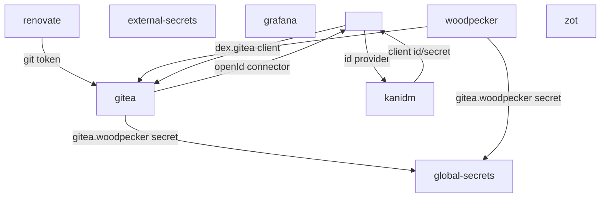

## Dex
- pod
  - reads secrets from global-secrets namespace 
    - kanidm.dex
      - client_id
      - client_secret
    - dex.grafana
    - dex.gitea
- post-install
  - read dex.gitea secret from global-secrets namespace (generated by global-secrets secret generator)
  - construct discovery url from ingress in dex namespace
  - exec into gitea pod use gitea cli to add dex as oauth provider

## Kanidm
- post-install
  - recover admin password
  - recover idm_admin password
  - using kanidm cli
    - login with admin
    - login with idm_admin
    - with idm_admin, create group
      - editor
    - register dex as auth client
      - construct redirect url from ingress in dex namespace
      - config warning-insecure-client-disable-pkce
      - config create-scope-map
      - create client secret
      - store kanidm.dex in global-secrets namespace
        - client_id
        - client_secret

## Grafana
- pod
  - reads secrets from global-secrets namespace 
    - dex.grafana
      - client_secret

## Renovate
- pod
  - reads secrets from global-secrets namespace 
    - gitea.renovate
      - token -> depends on post-install steps
- post-install
  - using gitea cli, and gitea admin password
    - create token for renovate to use

### Challenge
It's weird to me that Renovate is added to the cluster, depending on a post-install step. The alternative is to add a job
to the chart, configuring the depended-upon secret. This would remove a dependency on post-install, and eliminate a 
secret from the global-cluster namespace. Which is a good thing. The downside is that the job would access to the
gitea admin password.
